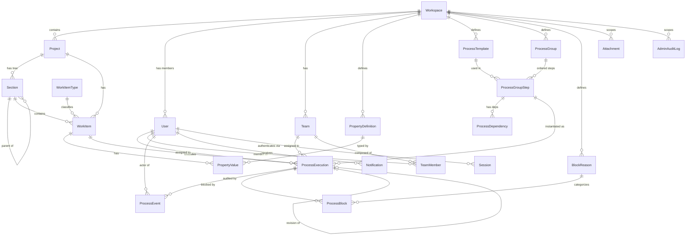
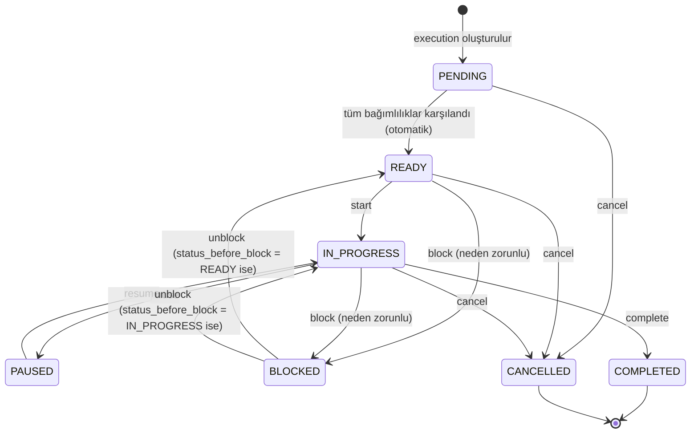

# Üretim ve Montaj Takip Sistemi — Teknik Mimari Dokümanı

> Bu doküman `MASTER-PLAN.md` tarafından tanımlanan ürün gereksinimlerinin teknik uygulama mimarisidir.
> Sürüm: 1.0 — MVP mimarisi. Geniş çaplı UI geliştirmesine başlanmadan önce bu doküman review edilmelidir.

---

## İçindekiler

1. [Sistem Genel Bakış](#1-sistem-genel-bakış)
2. [Sabit Teknoloji Yığını](#2-sabit-teknoloji-yığını)
3. [SvelteKit Frontend Mimarisi](#3-sveltekit-frontend-mimarisi)
4. [Flowbite Wrapper Stratejisi](#4-flowbite-wrapper-stratejisi)
5. [Rust / Axum Backend Mimarisi](#5-rust--axum-backend-mimarisi)
6. [SQLx Repository Stratejisi](#6-sqlx-repository-stratejisi)
7. [SQLite Development Stratejisi](#7-sqlite-development-stratejisi)
8. [PostgreSQL Staging/Production Stratejisi](#8-postgresql-stagingproduction-stratejisi)
9. [Cross-Database Uyumluluk Kuralları](#9-cross-database-uyumluluk-kuralları)
10. [Domain Modeli ve ER Diyagramı](#10-domain-modeli-ve-er-diyagramı)
11. [Veritabanı Şeması (Tablo Tanımları)](#11-veritabanı-şeması-tablo-tanımları)
12. [State Machine](#12-state-machine)
13. [Process Event Modeli](#13-process-event-modeli)
14. [RBAC İzin Matrisi](#14-rbac-izin-matrisi)
15. [REST API Endpoint Listesi](#15-rest-api-endpoint-listesi)
16. [SSE Event Listesi](#16-sse-event-listesi)
17. [Transaction Sınırları](#17-transaction-sınırları)
18. [File Storage Abstraction](#18-file-storage-abstraction)
19. [Error Model](#19-error-model)
20. [Klasör Yapıları](#20-klasör-yapıları)
21. [Test Stratejisi](#21-test-stratejisi)
22. [Deployment Topolojisi](#22-deployment-topolojisi)
23. [Güvenlik Önlemleri](#23-güvenlik-önlemleri)
24. [ID, Zaman ve Logging Kuralları](#24-id-zaman-ve-logging-kuralları)

---

## 1. Sistem Genel Bakış

```text
┌─────────────────────────────────────────┐
│              WEB BROWSER                │
│                                         │
│  SvelteKit + TypeScript                 │
│  Tailwind + Flowbite Svelte             │
│  Custom Domain Components               │
└────────────────┬────────────────────────┘
                 │
             REST + SSE
                 │
┌────────────────▼────────────────────────┐
│              RUST API                   │
│                                         │
│  Axum · Tokio · Serde                   │
│  Application Services                   │
│  Process Engine (state machine)         │
│  RBAC · Event/Audit                     │
└────────────────┬────────────────────────┘
                 │
                SQLx
                 │
        ┌────────▼────────┐
        │                 │
   Development      Staging/Prod
        │                 │
      SQLite          PostgreSQL
```

Sistem çok kiracılı (multi-workspace) bir üretim operasyon takip sistemidir. Temel akış:

1. Yönetici workspace → proje → sınırsız iç içe section ağacı → iş kalemleri kurar.
2. İş kalemlerine süreç grupları (ProcessGroup) atanır; her adım için ProcessExecution kayıtları oluşur.
3. Çalışanlar mobil web arayüzünden başlat/duraklat/devam/bitir/bloke aksiyonları alır.
4. Her aksiyon backend'de state machine + bağımlılık kontrolünden geçer, event üretilir ve SSE ile canlı yayınlanır.
5. Yönetici dashboard, matris ve üretim akışı ekranlarından durumu gerçek zamanlı izler.

**Kritik prensip:** "150 dairelik mutfak tezgahı takip uygulaması" değil; hiyerarşik proje yapılarındaki iş kalemlerinin tanımlanabilir süreçler boyunca gerçek zamanlı takip edildiği genel amaçlı bir sistem. Kesim/imalat/nakliye/montaj kavramları yalnızca seed verisinde bulunur, kodda hard-code edilmez.

---

## 2. Sabit Teknoloji Yığını

Bu kararlar değiştirilemez (MASTER PLAN §121):

| Katman | Teknoloji |
|---|---|
| Frontend framework | SvelteKit + TypeScript |
| CSS | Tailwind CSS |
| UI primitives | Flowbite Svelte (wrapper arkasında) |
| Backend | Rust + Axum |
| Async runtime | Tokio |
| Serialization | Serde |
| DB erişimi | SQLx (ORM değil) |
| Development DB | SQLite |
| Staging / Production DB | PostgreSQL |
| Realtime | Server-Sent Events (SSE) |
| Auth | Server-side session + HttpOnly cookie |
| Migration | SQLx migrations |
| Logging | tracing + tracing-subscriber |
| ID | UUIDv7 (uygulama tarafında üretilir) |
| Deployment | Docker + reverse proxy |

**Yasak:** Prisma, Drizzle, Node backend, Supabase, Firebase, production'da SQLite, sebepsiz WebSocket, ilk sürümde zorunlu Redis, Flowbite dışında UI kit.

---

## 3. SvelteKit Frontend Mimarisi

### 3.1. Route Yapısı

```text
src/routes/
├── +layout.svelte                 # kök layout (theme, global providers)
├── +layout.server.ts              # session kontrolü
│
├── (login)/
│   └── login/
│       └── +page.svelte
│
├── (app)/
│   ├── +layout.svelte             # authenticated shell: sidebar + topbar
│   ├── +layout.server.ts          # auth guard: session yoksa /login'e yönlendir
│   │
│   ├── dashboard/
│   │   └── +page.svelte           # global yönetici dashboard
│   │
│   ├── projects/
│   │   ├── +page.svelte           # proje listesi
│   │   └── [projectId]/
│   │       ├── +layout.svelte     # proje alt navigasyonu
│   │       ├── +layout.server.ts  # proje erişim kontrolü + proje context
│   │       ├── dashboard/         # genel bakış
│   │       ├── tree/              # bölüm ağacı
│   │       ├── matrix/            # kat/daire matrisi
│   │       ├── flow/              # üretim akışı (kanban)
│   │       ├── activity/          # aktivite timeline
│   │       └── reports/           # raporlar
│   │
│   ├── my-work/                   # çalışan arayüzü (mobil öncelikli)
│   │   └── +page.svelte
│   │
│   └── admin/
│       ├── users/
│       ├── teams/
│       ├── process-templates/
│       ├── process-groups/
│       └── properties/
```

Auth-aware routing `(app)` grubunda merkezî olarak yapılır; her sayfada ayrı kontrol tekrarlanmaz.

### 3.2. Feature Mimarisi

Route klasörleri yalnızca sayfa kompozisyonu içerir. Business davranış `src/lib/features/` altındadır:

```text
src/lib/
├── components/
│   ├── ui/          # Flowbite wrapper'ları (AppButton, AppModal, ...)
│   ├── domain/      # ProcessCard, ProjectMatrix, ProcessTimeline, ...
│   └── layout/      # Sidebar, Topbar, AppShell
├── features/
│   ├── projects/
│   ├── sections/
│   ├── work-items/
│   ├── processes/
│   ├── teams/
│   ├── users/
│   ├── dashboard/
│   └── reports/
├── stores/          # feature bazlı küçük Svelte stores
├── services/        # API istemcisi + realtime
├── types/           # API DTO tipleri (backend DTO'larıyla eşleşir)
├── utils/
└── config/          # status token'ları, sabitler
```

Her feature klasörü kendi component, store ve servis dosyalarını içerebilir:

```text
features/processes/
├── components/
│   ├── ProcessCard.svelte
│   ├── ProcessTimeline.svelte
│   └── ProcessActions.svelte      # Başlat/Duraklat/Bitir buton grubu
├── stores/
│   └── processStore.ts
└── api.ts                          # süreç aksiyon API çağrıları
```

### 3.3. State Yönetimi Prensipleri

- **Server state** (projeler, işler, süreçler, dashboard verisi) API katmanından gelir; kopyası kalıcı global store'da tutulmaz.
- **UI state** (drawer açık mı, seçili satır, aktif tab, filtre paneli) feature bazlı küçük Svelte store'larındadır.
- Tek büyük global store **kullanılmaz**.
- Filtreler URL query parametrelerinde yaşar (`/projects/123/matrix?floor=8&status=BLOCKED`) → bookmark/share edilebilir.
- SSE event'i geldiğinde ilgili feature store invalidation tetikler; her component kendi `EventSource`'unu açmaz.

### 3.4. API Erişim Katmanı

```text
src/lib/services/api/
├── client.ts          # fetch wrapper: base URL, credentials, hata normalize etme
├── auth.ts
├── projects.ts
├── sections.ts
├── work-items.ts
├── processes.ts
├── teams.ts
├── users.ts
├── dashboard.ts
└── reports.ts
```

- Component içinde doğrudan `fetch()` **kullanılmaz**.
- `client.ts` tüm hataları `ApiError { code, message, details? }` şeklinde normalize eder.
- Optimistic UI: başlat/bitir aksiyonlarında buton anında tepki verir, hata gelirse state geri alınır ve toast gösterilir. Server source-of-truth'dur.

### 3.5. Realtime (SSE) Entegrasyonu

```text
src/lib/services/realtime.ts
```

Tek merkezî servis:

- `EventSource` bağlantısını açar/kapatır (workspace/project scope'lu tek bağlantı).
- Otomatik reconnect (exponential backoff) uygular.
- Gelen event'leri parse edip kayıtlı subscriber'lara dağıtır (`subscribe(eventType, handler)`).
- İlgili server-state cache'lerini invalidate eder.
- Her component ayrı bağlantı açmaz.

### 3.6. Responsive Strateji

| Kırılım | Genişlik | Hedef |
|---|---|---|
| Mobil | ≥ 375px | Çalışan arayüzü birincil; tablolar → card/list |
| Tablet | ≥ 768px | Orta yoğunluk |
| Desktop | ≥ 1280px | Yönetici dashboard, yüksek bilgi yoğunluğu |
| Geniş | ≥ 1920px | TV modu / tam ekran fabrika görünümü |

Mobilde: sidebar drawer'a döner, sticky action bar kullanılır, kritik butonlar ekran altında başparmakla erişilebilir.

---

## 4. Flowbite Wrapper Stratejisi

### 4.1. Katmanlı Yapı

```text
Flowbite Svelte
    ↓
UI Wrapper Components   (src/lib/components/ui/)
    ↓
Domain Components       (src/lib/components/domain/ + features/)
    ↓
Pages                   (src/routes/)
```

Domain component'ler Flowbite API'sini **doğrudan** bilmez. Flowbite değişirse yalnızca wrapper katmanı güncellenir.

### 4.2. Wrapper Envanteri (MVP)

```text
src/lib/components/ui/
├── AppButton.svelte
├── AppIconButton.svelte
├── AppInput.svelte
├── AppTextarea.svelte
├── AppSelect.svelte
├── AppMultiSelect.svelte
├── AppDatePicker.svelte
├── AppDateTimePicker.svelte
├── AppBadge.svelte
├── StatusBadge.svelte        # status → token eşlemesi burada tek yerde
├── AppAvatar.svelte
├── UserPicker.svelte
├── TeamPicker.svelte
├── AppDrawer.svelte
├── AppModal.svelte
├── AppDropdown.svelte
├── AppTabs.svelte
├── AppTable.svelte           # DataTable primitive
├── FilterBar.svelte
├── SearchBox.svelte
├── AppTooltip.svelte
├── AppToast.svelte / toast store
├── AppProgress.svelte
├── EmptyState.svelte
├── Skeleton.svelte           # satır/kart skeleton varyantları
└── ConfirmDialog.svelte
```

Aynı işlev için farklı ekranlarda farklı component yapılmaz.

### 4.3. Status Token Sistemi

Renkler asla component içinde hard-code edilmez. Tek kaynak `src/lib/config/status.ts`:

```ts
export const STATUS_TOKENS = {
  PENDING:   { color: 'gray',   icon: 'clock',     label: 'Bekliyor' },
  READY:     { color: 'amber',  icon: 'play',      label: 'Hazır' },
  IN_PROGRESS: { color: 'blue', icon: 'spinner',   label: 'Devam Ediyor' },
  PAUSED:    { color: 'orange', icon: 'pause',     label: 'Duraklatıldı' },
  BLOCKED:   { color: 'red',    icon: 'warning',   label: 'Bloke' },
  COMPLETED: { color: 'green',  icon: 'check',     label: 'Tamamlandı' },
  CANCELLED: { color: 'slate',  icon: 'x',         label: 'İptal' }
} as const;
```

Karşılık gelen CSS custom property'leri (`--status-*`) Tailwind theme katmanında tanımlanır. Matris hücreleri ve tüm badge'ler renk + ikon + tooltip birlikte kullanır (renk körlüğü erişilebilirliği).

### 4.4. Flowbite Kullanılmayan Yerler

Aşağıdaki ekranlar custom Svelte component'leridir (Flowbite yalnızca içlerindeki primitive'ler için):

- Kat/Daire/Bölüm Matrisi (CSS grid tabanlı; standart HTML table'a zorlanmaz)
- Canlı Üretim Dashboardu
- Üretim Akışı (kanban)
- Process Timeline
- Canlı Fabrika / TV modu
- Çalışan iş kartları (büyük butonlu mobil ekran)
- Darboğaz görselleştirmesi

Çalışan mobil ekranı, masaüstü admin layout'unun küçültülmüş hâli değildir; ayrı tasarlanır.

---

## 5. Rust / Axum Backend Mimarisi

### 5.1. Katmanlı Yapı

```text
Axum Handler (api/)
    ↓
Application Service (application/)
    ↓
Domain Rules (domain/)
    ↓
Repository (infrastructure/)
    ↓
SQLx
```

- Handler incedir: request parse → auth context → service çağrısı → response DTO.
- Handler doğrudan SQL çalıştırmaz.
- Business logic handler'a gömülmez.
- Aşırı teorik DDD uygulanmaz; pragmatik katman ayrımı yeterlidir.

### 5.2. Backend Klasör Yapısı

```text
backend/
├── src/
│   ├── main.rs                   # bootstrap: config, tracing, DB pool, router
│   ├── config/
│   │   └── mod.rs                # env okuma + başlangıçta validasyon
│   ├── api/
│   │   ├── routes/
│   │   │   ├── mod.rs            # router kompozisyonu (/api/v1)
│   │   │   ├── auth.rs
│   │   │   ├── workspaces.rs
│   │   │   ├── projects.rs
│   │   │   ├── sections.rs
│   │   │   ├── work_items.rs
│   │   │   ├── properties.rs
│   │   │   ├── process_templates.rs
│   │   │   ├── process_groups.rs
│   │   │   ├── process_executions.rs
│   │   │   ├── teams.rs
│   │   │   ├── users.rs
│   │   │   ├── attachments.rs
│   │   │   ├── notifications.rs
│   │   │   ├── dashboard.rs
│   │   │   ├── activity.rs
│   │   │   └── reports.rs
│   │   ├── handlers/             # (gerekirse route dosyalarıyla birleştirilebilir)
│   │   └── middleware/
│   │       ├── auth.rs           # session çözümleme, AuthContext üretme
│   │       ├── workspace.rs      # workspace izolasyonu
│   │       └── request_context.rs# request_id vs.
│   ├── application/
│   │   ├── services/
│   │   │   ├── auth_service.rs
│   │   │   ├── project_service.rs
│   │   │   ├── section_service.rs
│   │   │   ├── work_item_service.rs
│   │   │   ├── process_execution_service.rs   # start/pause/resume/block/complete
│   │   │   ├── assignment_service.rs
│   │   │   ├── dashboard_service.rs
│   │   │   └── report_service.rs
│   │   └── dto/                  # API request/response modelleri (Serde)
│   ├── domain/
│   │   ├── entities/             # Workspace, Project, Section, WorkItem, ProcessExecution...
│   │   ├── value_objects/        # ProcessStatus, Priority, PropertyDataType...
│   │   ├── errors/               # DomainError (PROCESS_NOT_READY vs.)
│   │   └── services/
│   │       ├── process_engine.rs # state machine + bağımlılık çözümleyici
│   │       ├── duration.rs       # aktif/bekleme/bloke süre hesaplayıcı
│   │       └── permissions.rs    # RBAC kontrol fonksiyonları
│   ├── infrastructure/
│   │   ├── db/
│   │   │   ├── mod.rs            # PgPool / SqlitePool kurulumu
│   │   │   └── migrations.rs
│   │   ├── repositories/
│   │   │   ├── project_repository.rs
│   │   │   ├── section_repository.rs
│   │   │   ├── work_item_repository.rs
│   │   │   ├── process_repository.rs
│   │   │   ├── event_repository.rs
│   │   │   ├── team_repository.rs
│   │   │   ├── user_repository.rs
│   │   │   ├── attachment_repository.rs
│   │   │   └── notification_repository.rs
│   │   ├── storage/
│   │   │   ├── mod.rs            # FileStorage trait
│   │   │   ├── local.rs          # LocalFileStorage
│   │   │   └── s3.rs             # S3FileStorage (production)
│   │   └── realtime/
│   │       └── sse.rs            # SSE hub: kanal yönetimi, event yayını
│   └── shared/                   # genel yardımcılar (time, uuid, pagination)
├── migrations/
│   ├── 0001_initial.sql
│   ├── 0002_process_events.sql
│   ├── 0003_attachments.sql
│   └── ...
├── tests/                        # integration testler
└── Cargo.toml
```

### 5.3. Process Engine (Merkezî Süreç Motoru)

`domain/services/process_engine.rs` — sistemin kalbi. Tüm durum geçişleri buradan geçer:

```rust
pub fn can_start(exec: &ProcessExecution) -> Result<(), DomainError> { ... }
pub fn can_pause(exec: &ProcessExecution) -> Result<(), DomainError> { ... }
pub fn can_resume(exec: &ProcessExecution) -> Result<(), DomainError> { ... }
pub fn can_complete(exec: &ProcessExecution) -> Result<(), DomainError> { ... }
pub fn can_block(exec: &ProcessExecution) -> Result<(), DomainError> { ... }

// Bağımlılık çözümleme: bir execution COMPLETED olduğunda
// aynı WorkItem'ın diğer execution'larından bağımlılığı karşılananlar PENDING → READY
pub fn resolve_downstream(tx, work_item_id, completed_step_id) -> Vec<ProcessExecution> { ... }
```

Sorumlulukları:

- Geçiş kurallarını doğrulamak (izin verilen geçişler §12'deki tablo).
- Bağımlılık kontrolü ve `markReadyProcesses`.
- Süre hesaplama girdilerini hazırlamak (aktif/bekleme/bloke süre ayrımı).
- Her geçişte üretilecek `ProcessEvent` tipini belirlemek.

Business kural UI'a dağılmaz; backend tek yetkilidir.

### 5.4. Örnek Akış: `POST /api/v1/process-executions/:id/start`

```text
Handler
  1. AuthContext'i çıkar (middleware doldurur)
  2. yetki kontrolü: permissions::can(user, "process.start", exec)
  3. ProcessExecutionService::start(execution_id, actor)
Service
  4. BEGIN TRANSACTION
  5. exec = repo.find_for_update(execution_id)   -- row lock / version check
  6. process_engine::can_start(&exec)?
  7. repo.update_status(exec, IN_PROGRESS, started_at=now, version+1)
  8. events.insert(ProcessEvent::STARTED, prev=READY, actor)
  9. COMMIT
  10. sse_hub.publish("process.started", payload)
  11. notification_service.evaluate_rules(exec)
```

### 5.5. Concurrency Stratejisi

- `process_executions.version` kolonu (optimistic locking): UPDATE ... WHERE id = ? AND version = ?. Etkilenen satır 0 ise `409 VERSION_CONFLICT`.
- Kritik aksiyonlarda (start/complete) ayrıca `SELECT ... FOR UPDATE` (PostgreSQL) / transaction serialize (SQLite) desteklenir; iki mekanizmadan en az biri aktiftir.
- Aynı execution'ı iki kullanıcının aynı anda başlatması engellenir.

---

## 6. SQLx Repository Stratejisi

- **ORM kullanılmaz.** Kontrollü SQL + SQLx.
- Query'ler repository katmanında izole edilir; service katmanı SQL bilmez.
- Compile-time checked queries (`query!` makrosu) PostgreSQL derleme ortamı gerektirdiğinden ilk aşamada **runtime-checked** `sqlx::query_as::<...>` yaklaşımı + integration test kapsamı kullanılır; CI'da PostgreSQL karşı `cargo sqlx prepare` doğrulaması eklenir.
- Tüm entity sorguları `workspace_id` filtresiyle başlar (tenant izolasyonu repository katmanında garanti edilir).
- N+1 önleme: liste sorgularında JOIN veya `IN (...)` ile toplu getirme; dashboard için aggregate endpoint'ler.
- Transaction yönetimi service katmanındadır; repository fonksiyonları opsiyonel `&mut TransactionExecutor` alır.

Repository imza örneği:

```rust
#[async_trait]
pub trait ProcessExecutionRepository {
    async fn find_for_update(&self, tx: &mut DbTx, id: Uuid) -> Result<ProcessExecution>;
    async fn update_status(&self, tx: &mut DbTx, id: Uuid, new_status: &ProcessStatus,
                           patch: &StatusPatch, expected_version: i64) -> Result<u64>;
    async fn list_by_work_item(&self, work_item_id: Uuid) -> Result<Vec<ProcessExecution>>;
    async fn pending_by_dependent_step(&self, tx: &mut DbTx, work_item_id: Uuid,
                                       step_id: Uuid) -> Result<Vec<ProcessExecution>>;
    async fn count_by_status(&self, project_id: Uuid) -> Result<Vec<(Uuid, ProcessStatus, i64)>>;
}
```

---

## 7. SQLite Development Stratejisi

- Yalnızca **development ve lokal demo** ortamı: hızlı kurulum, tek dosya, seed kolaylığı.
- `DATABASE_URL=sqlite://data/app.db?mode=rwc`
- Foreign keys açılır (`PRAGMA foreign_keys = ON` — SQLx bağlantı seçeneklerinde).
- WAL modu önerilir (`PRAGMA journal_mode = WAL`) — eşzamanlı okuma ihtiyacı için.
- Production'da **asla** SQLite kullanılmaz.
- Demo seed: Gardenia Demo (15 kat × 10 daire = 150 WorkItem, süreç grubu, 6 kullanıcı, 4 takım, rastgele durumlar).

## 8. PostgreSQL Staging/Production Stratejisi

- Staging ve production'da PostgreSQL: eşzamanlılık, row locking, güçlü indexing, backup/replication, JSON/tarih özellikleri.
- Kullanıcı kabul testlerinden önce staging PostgreSQL üzerinde çalışır.
- Connection pool: SQLx `PgPoolOptions` (max_connections config'ten).
- Production öncesi zorunlu kontrol (MASTER PLAN §116): sıfırdan migration → seed → integration test → concurrent start testi → aggregate sorgu performansı.

## 9. Cross-Database Uyumluluk Kuralları

Uygulama ilk günden PostgreSQL'e geçiş düşünülerek yazılır:

| Konu | Kural |
|---|---|
| ID | UUIDv7 string; SQLite `TEXT`, PostgreSQL `UUID` — dönüşüm repository/SQLx tip eşlemesinde |
| Auto increment | Kullanılmaz; ID'ler uygulama tarafında üretilir |
| Boolean | `BOOLEAN` her iki DB'de destekli; literal olarak `1/0` yerine parametre bağlama kullanılır |
| Timestamp | `TIMESTAMPTZ` (PG) / `TEXT` ISO-8601 UTC (SQLite); Rust tarafında `chrono::DateTime<Utc>`, string bazlı manuel tarih işlemi yapılmaz |
| JSON | `metadata` alanları PG `JSONB` / SQLite `TEXT`; serileştirme Rust tarafında |
| UPSERT | `INSERT ... ON CONFLICT` ortak subset (do 21 farklarına dikkat; gerekirse repo tarafında izole) |
| DDL | Migration dosyaları iki dialect'i de destekler: ortak SQL kullanılır, mümkün değilse `migrations/sqlite/` ve `migrations/postgres/` ayrımı yapılır |
| Vendor SQL | Business/service katmanına gömülmez; dialect farkı repository katmanında izole edilir |
| Case sensitivity | `ILIKE` yerine `LOWER(x) LIKE LOWER(?)` ortak yaklaşımı |
| Locking | `FOR UPDATE` yalnızca PG yolunda; SQLite'ta transaction serialize + version kontrolü |

---

## 10. Domain Modeli ve ER Diyagramı

### 10.1. ER Diyagramı (Mermaid)



### 10.2. Entity Listesi ve Sorumlulukları

| Entity | Sorumluluk |
|---|---|
| Workspace | Üst seviye tenant; tüm veri izolasyon sınırı |
| User | Sistem kullanıcısı; rol ve workspace üyeliği |
| Session | Server-side oturum (HttpOnly cookie token → kayıt) |
| Team / TeamMember | Ekipler ve üyelik |
| Project | Bir teslim projesi (durumlu: DRAFT→ACTIVE→...) |
| Section | Sınırsız iç içe hiyerarşi (parentId recursive); blok/kat/daire hard-code edilmez |
| WorkItemType | İş kalemi tipi (Mutfak Tezgahı, Banyo Tezgahı, ...) |
| WorkItem | Takip edilen esas iş; section + tip + dinamik özellikler |
| PropertyDefinition / PropertyValue | Tip güvenli dinamik özellik sistemi |
| ProcessTemplate | Süreç tanımı (Kesim, İmalat, ...) — workspace seviyesinde tanımlanır, kodda hard-code edilmez |
| ProcessGroup / ProcessGroupStep | Bir iş kalemine uygulanacak süreç dizisi ve sıralı adımları |
| ProcessDependency | Adımlar arası çoklu bağımlılık (lineer varsayılmaz) |
| ProcessExecution | Bir iş kaleminin bir adım somut çalıştırılması; state machine sahibi; version (optimistic lock) + revisionNo/parentExecutionId (revizyon) |
| ProcessEvent | Immutable işlem geçmişi (audit trail) |
| ProcessBlock / BlockReason | Bloke kayıtları ve yönetilebilir neden kataloğu |
| Attachment | Polymorphic dosya eki (storage key + metadata) |
| Notification | Uygulama içi bildirim |
| AdminAuditLog | Yönetimsel işlemlerin denetim kaydı (ProcessEvent'ten ayrı) |

---

## 11. Veritabanı Şeması (Tablo Tanımları)

Ortak kurallar:

- PK: `id UUID` (app-generated UUIDv7).
- Her tabloda uygun yerde `workspace_id` (izolasyon) + `created_at`, `updated_at TIMESTAMPTZ`.
- Kritik domain kayıtlarında soft delete: `deleted_at TIMESTAMPTZ NULL`; `process_events` tamamen **immutable** (update/delete yok).
- Tüm FK'ler indexli; tüm sorgular workspace sınırında.

### 11.1. Kimlik ve Tenant

```sql
workspaces (
  id PK, name, slug UNIQUE, description,
  created_at, updated_at
)

users (
  id PK, workspace_id FK, email, password_hash,
  full_name, role,                -- ADMIN|PROJECT_MANAGER|TEAM_LEADER|WORKER|VIEWER
  active, created_at, updated_at,
  UNIQUE (workspace_id, email)
)

sessions (
  id PK,                  -- token hash (cookie'de rastgele token, DB'de hash)
  user_id FK, workspace_id FK,
  created_at, expires_at,      -- expires_at index
  user_agent, ip
)

teams (
  id PK, workspace_id FK, name, description, created_at, updated_at
)

team_members (
  team_id FK, user_id FK, role,     -- LEADER | MEMBER
  PK (team_id, user_id)
)
```

### 11.2. Proje Yapısı

```sql
projects (
  id PK, workspace_id FK,
  name, code, description, status,   -- DRAFT|ACTIVE|PAUSED|COMPLETED|CANCELLED|ARCHIVED
  planned_start_date, planned_end_date,
  actual_start_date, actual_end_date,
  created_at, updated_at, deleted_at
)
CREATE INDEX idx_projects_ws_status ON projects (workspace_id, status);

sections (
  id PK, workspace_id FK, project_id FK,
  parent_id FK NULL REFERENCES sections(id),
  name, code, type,          -- type: opsiyonel etiket (BLOCK/FLOOR/.../CUSTOM; serbest)
  sort_order, metadata,
  created_at, updated_at, deleted_at
)
CREATE INDEX idx_sections_project_parent ON sections (project_id, parent_id);
-- recursive sorgular: PG'de WITH RECURSIVE; SQLite 3.8+ aynı destekli

work_item_types (
  id PK, workspace_id FK, name, code, active, created_at, updated_at
)

work_items (
  id PK, workspace_id FK, project_id FK, section_id FK,
  work_item_type_id FK,
  name, code, status, priority,      -- LOW|NORMAL|HIGH|URGENT
  planned_start_at, planned_end_at,
  created_at, updated_at, deleted_at
)
CREATE INDEX idx_work_items_project_status ON work_items (project_id, status);
CREATE INDEX idx_work_items_section ON work_items (section_id);
```

### 11.3. Dinamik Özellikler

```sql
property_definitions (
  id PK, workspace_id FK,
  name, key, data_type,       -- TEXT|LONG_TEXT|NUMBER|DECIMAL|BOOLEAN|DATE|DATETIME|SELECT|MULTI_SELECT
  unit NULL, required, options NULL,   -- options: SELECT/MULTI_SELECT seçenek listesi (JSON)
  created_at, updated_at,
  UNIQUE (workspace_id, key)
)

property_values (
  id PK, work_item_id FK, property_definition_id FK,
  value TEXT NULL, value_number NUMERIC NULL, value_bool BOOLEAN NULL,
  -- typed kolonlar: dataType'a göre biri dolar; okurken definition'daki tip belirleyici
  created_at, updated_at,
  UNIQUE (work_item_id, property_definition_id)
)
```

### 11.4. Süreç Tanımları

```sql
process_templates (
  id PK, workspace_id FK,
  name, code, description,
  default_duration NULL, color NULL, icon NULL, active,
  created_at, updated_at,
  UNIQUE (workspace_id, code)
)

process_groups (
  id PK, workspace_id FK, name, description, active,
  created_at, updated_at
)

process_group_steps (
  id PK, process_group_id FK, process_template_id FK,
  sort_order, required,
  UNIQUE (process_group_id, sort_order)
)

process_dependencies (
  id PK, process_group_step_id FK,
  depends_on_process_group_step_id FK,
  required_status,        -- genellikle COMPLETED
  CHECK (process_group_step_id <> depends_on_process_group_step_id)
)
```

### 11.5. Süreç Çalıştırma

```sql
process_executions (
  id PK, workspace_id FK, work_item_id FK,
  process_template_id FK, process_group_step_id FK,

  status,                  -- PENDING|READY|IN_PROGRESS|PAUSED|BLOCKED|COMPLETED|CANCELLED
  status_before_block NULL,  -- unblock doğru hedefe dönsün diye (READY|IN_PROGRESS)
  version BIGINT NOT NULL DEFAULT 0,     -- optimistic locking

  assigned_user_id NULL FK, assigned_team_id NULL FK,
  planned_start_at NULL, planned_end_at NULL,
  ready_at NULL, started_at NULL, completed_at NULL,

  revision_no INT NOT NULL DEFAULT 0,
  parent_execution_id NULL FK REFERENCES process_executions(id),

  created_at, updated_at, deleted_at
)
CREATE UNIQUE INDEX uq_exec_active_per_step
  ON process_executions (work_item_id, process_group_step_id)
  WHERE deleted_at IS NULL AND revision_no = (
    -- basit MVP: aynı adımın tek aktif execution'ı; revizyon açılırken eskisi bayraklanır
  );
-- Pratik kural: yeni revizyon açıldığında eski kaydın status'u korunur,
-- yeni kayıt parent_execution_id ile bağlanır. Unique kısıt yerine
-- service katmanı kuralı + (work_item_id, process_group_step_id, revision_no) unique.

CREATE INDEX idx_exec_status ON process_executions (workspace_id, status);
CREATE INDEX idx_exec_work_item ON process_executions (work_item_id);
CREATE INDEX idx_exec_assigned_user ON process_executions (assigned_user_id, status);
CREATE INDEX idx_exec_assigned_team ON process_executions (assigned_team_id, status);
CREATE INDEX idx_exec_planned_end ON process_executions (planned_end_at)
  WHERE status NOT IN ('COMPLETED','CANCELLED');
```

### 11.6. Event, Bloke, Bildirim, Ek

```sql
process_events (            -- IMMUTABLE: update/delete yolu yok
  id PK, workspace_id FK, process_execution_id FK,
  event_type,               -- bkz. §13
  previous_status NULL, new_status NULL,
  user_id FK, team_id NULL,
  timestamp, note NULL, metadata NULL,   -- metadata JSON
  created_at
)
CREATE INDEX idx_events_exec_time ON process_events (process_execution_id, timestamp DESC);
CREATE INDEX idx_events_ws_time ON process_events (workspace_id, timestamp DESC);

block_reasons (
  id PK, workspace_id FK, name, description, active, sort_order
)

process_blocks (
  id PK, process_execution_id FK, reason_id FK,
  description, created_by FK, created_at,
  resolved_by NULL FK, resolved_at NULL, resolution_note NULL
)

attachments (
  id PK, workspace_id FK,
  entity_type,              -- PROJECT|SECTION|WORK_ITEM|PROCESS_EXECUTION|PROCESS_EVENT
  entity_id,
  file_name, storage_key,   -- storage abstraction anahtarı (URL değil)
  mime_type, size,
  uploaded_by FK, created_at,
  deleted_at
)
CREATE INDEX idx_attachments_entity ON attachments (entity_type, entity_id);

notifications (
  id PK, user_id FK, workspace_id FK,
  type, title, message,
  entity_type NULL, entity_id NULL,
  read_at NULL, created_at
)
CREATE INDEX idx_notifications_user_unread ON notifications (user_id, read_at);

admin_audit_logs (
  id PK, workspace_id FK, user_id FK,
  action, entity_type NULL, entity_id NULL,
  metadata NULL, timestamp
)
```

---

## 12. State Machine

### 12.1. Durumlar

```text
PENDING     Ön koşullar henüz tamamlanmamış
READY       Başlangıç şartları sağlanmış
IN_PROGRESS Aktif çalışma
PAUSED      Geçici durdurulmuş
BLOCKED     Harici problem, devam edemiyor
COMPLETED   Tamamlanmış
CANCELLED   İptal edilmiş
```

### 12.2. Geçiş Diyagramı



### 12.3. Geçiş Matrisi (izin verilenler)

| From \ Action | start | pause | resume | block | unblock | complete | cancel |
|---|---|---|---|---|---|---|---|
| PENDING | – | – | – | – | – | – | ✓ |
| READY | ✓ | – | – | ✓ | – | – | ✓ |
| IN_PROGRESS | – | ✓ | – | ✓ | – | ✓ | ✓ |
| PAUSED | – | – | ✓ | – | – | – | – |
| BLOCKED | – | – | – | – | ✓ | – | – |
| COMPLETED | – | – | – | – | – | – | – |
| CANCELLED | – | – | – | – | – | – | – |

### 12.4. Kurallar

- Geçiş kuralları **backend'de** doğrulanır; frontend yalnızca görseldir.
- Geçiş state machine dışına çıkamaz; geçersiz istek `409 INVALID_TRANSITION` alır.
- `COMPLETED`'dan geri dönüş yok. Revizyon gerekirse **yeni** ProcessExecution (`revisionNo + 1`, `parentExecutionId → orijinal`) açılır; orijinal kayıt ve geçmişi asla değişmez.
- `BLOCKED`'a girerken `status_before_block` yazılır; unblock bu değere döner.
- Her geçiş, geçişi üreten aksiyonla aynı transaction'da bir ProcessEvent üretir (event'siz status değişikliği yasak).
- `PENDING → READY` kullanıcı aksiyonu değil, dependency resolver'ın otomatik sonucudur; READY event'i de üretilir.

### 12.5. Süre Hesaplama

```text
activeDuration    = Σ (STARTED→PAUSED) + (RESUMED→PAUSED|COMPLETED)   -- event'lerden türetilir
pausedDuration    = Σ (PAUSED→RESUMED)
blockedDuration   = Σ (BLOCKED→UNBLOCKED)
totalLeadTime     = first STARTED → COMPLETED (takvim süresi, durmalar dahil)
waitingDuration   = createdAt/readyAt → STARTED arası bekleme
delay             = status != COMPLETED AND now > plannedEndAt  → LATE
```

Süreler event akışından `domain/services/duration.rs` içinde hesaplanır; hesaplama birim testlerinin birincil hedefidir.

---

## 13. Process Event Modeli

### 13.1. Event Tipleri

```text
CREATED               READY                 ASSIGNED
STARTED               PAUSED                RESUMED
BLOCKED               UNBLOCKED             COMPLETED
REOPENED              CANCELLED             NOTE_ADDED
FILE_ADDED            ASSIGNEE_CHANGED      PLANNED_DATE_CHANGED
```

### 13.2. Kayıt Kuralları

- `process_events` tablosu **append-only**'dir: UPDATE/DELETE uçları yoktur, normal kullanıcılar silemez.
- Her status değişikliği mutlaka en az bir event üretir; event'siz status değişikliği kod yoluyla da yapılamaz (service katmanı tek giriş noktasıdır).
- `previous_status` / `new_status` durum geçişlerini, `metadata` ise ek bağlamı (ör. bloke reason, atanan kullanıcı) taşır.
- Event kayıtları dashboard'a tümüyle yüklenmez; dashboard aggregate endpoint'leri kullanır. Event listesi cursor-based pagination ile sunulur.

### 13.3. Örnek Zaman Çizelgesi

```text
09:13  READY      (dependency resolver)
09:17  STARTED    Ahmet
10:04  PAUSED     Ahmet — "Testere değişimi"
10:26  RESUMED    Ahmet
11:02  COMPLETED  Ahmet
```

---

## 14. RBAC İzin Matrisi

Roller: `ADMIN`, `PROJECT_MANAGER`, `TEAM_LEADER`, `WORKER`, `VIEWER`.

Kapsam kuralları:

- PM yetkisi **atanmış projelerle** sınırlıdır.
- TEAM_LEADER yetkisi **kendi takımına atanan** execution'larla sınırlıdır.
- WORKER yetkisi **kendisine atanan** execution'larla sınırlıdır.
- Yetki yalnızca frontend'de buton gizlemek değildir; **backend her istekte authorization yapar** (middleware + service kontrolü).

| İşlem | ADMIN | PROJECT_MANAGER | TEAM_LEADER | WORKER | VIEWER |
|---|:---:|:---:|:---:|:---:|:---:|
| Workspace yönetimi | ✓ | – | – | – | – |
| Kullanıcı oluşturma/yönetme | ✓ | – | – | – | – |
| Takım oluşturma | ✓ | – | – | – | – |
| Proje oluşturma | ✓ | – | – | – | – |
| Süreç şablonu/grubu yönetimi | ✓ | – | – | – | – |
| PropertyDefinition yönetimi | ✓ | – | – | – | – |
| BlockReason yönetimi | ✓ | – | – | – | – |
| Proje görüntüleme | ✓ | ✓ (atanan) | ✓ (atanan, takım kapsamı) | ✓ (atanan iş kapsamı) | ✓ (atanan) |
| Section/WorkItem oluşturma/düzenleme | ✓ | ✓ | – | – | – |
| Toplu işlem (atama, tarih, öncelik) | ✓ | ✓ | – | – | – |
| Kullanıcı/takım ata | ✓ | ✓ | takım içi | – | – |
| Süreç başlat | ✓ | ✓ | ✓ (takım işi) | ✓ (kendi işi) | – |
| Duraklat / Devam | ✓ | ✓ | ✓ (takım işi) | ✓ (kendi işi) | – |
| Bitir | ✓ | ✓ | ✓ (takım işi) | ✓ (kendi işi) | – |
| Sorun bildir (block) | ✓ | ✓ | ✓ | ✓ (kendi işi) | – |
| Bloke kaldır (unblock) | ✓ | ✓ | – | – | – |
| Not / fotoğraf ekle | ✓ | ✓ | ✓ | ✓ (kendi işi) | – |
| Plan tarihi değiştir | ✓ | ✓ | – | – | – |
| Manuel status override | ✓ | confirm ile | – | – | – |
| Revizyon açma (reopen) | ✓ | ✓ | – | – | – |
| Rapor görüntüleme | ✓ | ✓ (projesi) | takım raporu | – | ✓ |
| Dashboard görüntüleme | ✓ | ✓ | kapsamlı | kendi işleri | ✓ |
| Süreç geçmişini görüntüleme | ✓ | ✓ | ✓ | ✓ (kendi işi) | ✓ |
| Event/audit kayıtlarını silme | – | – | – | – | – |

`domain/services/permissions.rs` bu matrisi fonksiyonlara çevirir; her service çağrısı öncesinde `can(actor, action, resource)` kontrolü yapılır.

---

## 15. REST API Endpoint Listesi

Base: `/api/v1` · Format: JSON · Auth: HttpOnly session cookie · Filtreler query parametresi · Listeler cursor-based paginate.

### Auth

```text
POST   /auth/login                     email+password → session cookie
POST   /auth/logout
GET    /auth/me                        mevcut kullanıcı + rol + workspace
```

### Workspaces / Users / Teams

```text
GET    /workspaces                     ADMIN
POST   /workspaces                     ADMIN
GET    /workspaces/:id
PATCH  /workspaces/:id                 ADMIN

GET    /workspaces/:id/users           ADMIN
POST   /workspaces/:id/users           ADMIN
GET    /users/:id
PATCH  /users/:id                      ADMIN (rol, aktiflik)
DELETE /users/:id                      ADMIN (soft)

GET    /workspaces/:id/teams
POST   /workspaces/:id/teams
GET    /teams/:id
PATCH  /teams/:id
GET    /teams/:id/members
POST   /teams/:id/members
DELETE /teams/:id/members/:userId
```

### Projects

```text
GET    /projects?status=&q=            kapsamına göre
POST   /projects
GET    /projects/:id
PATCH  /projects/:id
POST   /projects/:id/archive           confirm
GET    /projects/:id/activity          timeline (cursor)
```

### Sections

```text
GET    /projects/:id/sections/tree     tam ağaç
POST   /projects/:id/sections          tek section
PATCH  /sections/:id
DELETE /sections/:id                   soft, confirm
POST   /projects/:id/sections/bulk     bulk generator (başlangıç/adet/format)
POST   /sections/:id/clone             "katı çoğalt ×14"
```

### WorkItems + Properties

```text
GET    /projects/:id/work-items?sectionId=&status=&assignee=&priority=&late=&q=
POST   /projects/:id/work-items
POST   /projects/:id/work-items/bulk   çoklu oluşturma (section listesi × tip)
GET    /work-items/:id                 detay + özellikler + execution özeti
PATCH  /work-items/:id
POST   /work-items/:id/assign-process-group
POST   /work-items/bulk-assign         toplu: atama/tarih/öncelik/süreç grubu
GET    /work-items/:id/history

GET    /workspaces/:id/property-definitions
POST   /workspaces/:id/property-definitions
PATCH  /property-definitions/:id
PUT    /work-items/:id/property-values  özellik değerlerini toplu yazar
```

### Process Tanımları

```text
GET    /workspaces/:id/process-templates
POST   /workspaces/:id/process-templates
PATCH  /process-templates/:id

GET    /workspaces/:id/process-groups
POST   /workspaces/:id/process-groups
GET    /process-groups/:id             steps + dependencies
PATCH  /process-groups/:id
POST   /process-groups/:id/steps
PATCH  /process-groups/:id/steps/:stepId
DELETE /process-groups/:id/steps/:stepId
POST   /process-groups/:id/dependencies
DELETE /process-groups/:id/dependencies/:depId
```

### Process Executions

```text
GET    /process-executions?projectId=&workItemId=&status=&teamId=&userId=&late=&priority=
GET    /process-executions/:id         detay + event geçmişi (ayrı endpoint'ten)
PATCH  /process-executions/:id         yalnız meta (planned tarihler vs.)

POST   /process-executions/:id/start          action endpoint
POST   /process-executions/:id/pause
POST   /process-executions/:id/resume
POST   /process-executions/:id/block          body: reasonId (zorunlu), description, attachmentIds
POST   /process-executions/:id/unblock        body: resolutionNote
POST   /process-executions/:id/complete       body: note?, attachmentIds?
POST   /process-executions/:id/cancel         confirm
POST   /process-executions/:id/reopen         body: reason → yeni revision execution
POST   /process-executions/:id/assign         userId | teamId
POST   /process-executions/:id/notes
GET    /process-executions/:id/events         cursor pagination, immutable

GET    /workspaces/:id/block-reasons
POST   /workspaces/:id/block-reasons          ADMIN
PATCH  /block-reasons/:id                     ADMIN
```

Durum değişikliği `PATCH status=...` ile **yapılmaz**; her zaman action endpoint kullanılır (business logic çalıştırılır).

### Attachments

```text
POST   /attachments                       multipart: file + entityType + entityId
GET    /attachments?entityType=&entityId=
GET    /attachments/:id/download           storage abstraction üzerinden stream
DELETE /attachments/:id                    soft, confirm
```

### Dashboard / Reports / Notifications

```text
GET    /dashboard/summary                          global KPI
GET    /projects/:id/dashboard-summary             aggregate (event tablosunu istemciye dökmez)
GET    /projects/:id/bottlenecks                   süreç başına READY/IN_PROGRESS yığılma
GET    /projects/:id/matrix?rowLevel=&colLevel=    matris hücre aggregate
GET    /my-work                                     kullanıcının iş kartları

GET    /projects/:id/reports/progress
GET    /projects/:id/reports/process-performance   ort. aktif/bekleme süresi
GET    /projects/:id/reports/team-performance
GET    /projects/:id/reports/export.xlsx           Excel dışa aktarım

GET    /notifications
POST   /notifications/:id/read
POST   /notifications/read-all
```

### Realtime

```text
GET    /events/stream                          SSE (workspace scope, auth gerekli)
GET    /projects/:id/events/stream             SSE (project scope)
```

---

## 16. SSE Event Listesi

### 16.1. Event Türleri ve Payload Şablonları

```text
process.started
process.paused
process.resumed
process.blocked
process.unblocked
process.completed
process.cancelled
process.assigned
process.reopened
work_item.updated
work_item.created
project.updated
notification.created
dashboard.invalidated        -- aggregate yeniden çekilmeli sinyali
```

Ortak payload iskeleti:

```json
{
  "event": "process.started",
  "workspaceId": "uuid",
  "projectId": "uuid",
  "workItemId": "uuid",
  "processExecutionId": "uuid",
  "actorUserId": "uuid",
  "timestamp": "2026-09-14T10:00:00Z",
  "data": { "previousStatus": "READY", "newStatus": "IN_PROGRESS" }
}
```

### 16.2. Kurallar

- Backend `infrastructure/realtime/sse.rs` içinde bir event hub tutar; transaction commit **sonrası** publish edilir (rollback olan işlem event üretmez).
- Frontend tek merkezî `realtime.ts` servisi bağlanır; event geldiğinde ilgili query/state yenilenir.
- Bağlantı koptuğunda client exponential backoff ile reconnect olur; reconnect'te `Last-Event-ID` ile kopan aralık toparlanabilir (MVP'de tam replay yerine state invalidation yeterlidir).
- SSE kanalları workspace ve project scope'ludur; yetkisiz kullanıcı bağlantısı açıldığı anda kapatılır.

---

## 17. Transaction Sınırları

Tüm multi-write işlemler tek transaction'da; herhangi bir adım başarısız olursa ROLLBACK.

### 17.1. `complete` örneği

```text
BEGIN
  1. SELECT execution FOR UPDATE / version kontrol
  2. can_complete(execution) kontrolü
  3. UPDATE process_executions → status=COMPLETED, completed_at=now, version+1
  4. INSERT process_events (COMPLETED, prev→new, actor)
  5. resolve_downstream: bağımlılıkları karşılanan execution'lar PENDING→READY
  6. her biri için INSERT process_events (READY)
  7. INSERT notifications (kural bazlı: atanmış kullanıcıya, bloke takipçisine)
COMMIT
→ SSE publish (commit sonrası)
```

### 17.2. Diğer transaction'lı operasyonlar

| Operasyon | Kapsam |
|---|---|
| `start` | status update + STARTED event |
| `block` | status update + ProcessBlock insert + BLOCKED event + notification |
| `unblock` | status update + ProcessBlock resolve + UNBLOCKED event |
| `assign` | assignment update + ASSIGNEE_CHANGED event (+ASSIGNED) |
| `reopen` | yeni revision execution insert + REOPENED event (orijinal kayda dokunulmaz) |
| `assign-process-group` | WorkItem için tüm step'lerin execution'larının oluşturulması + CREATED event'leri + ilk adımların READY'ye çekilmesi |
| `bulk section/clone` | ağaç kopyalama atomiktir |
| `login` | session insert + audit log |

**Kural:** Transaction içinde SSE publish / harici çağrı yapılmaz; bunlar commit sonrası yapılır.

---

## 18. File Storage Abstraction

```rust
pub trait FileStorage: Send + Sync {
    async fn put(&self, key: &str, stream: ByteStream, content_type: &str) -> Result<()>;
    async fn get(&self, key: &str) -> Result<ByteStream>;
    async fn delete(&self, key: &str) -> Result<()>;
    async fn presigned_url(&self, key: &str, ttl: Duration) -> Result<String>; // S3 impl
}
```

- Domain yalnızca `storage_key` + metadata bilir; URL veya disk yolu bilmez.
- Development: `LocalFileStorage` → `data/uploads/{workspaceId}/{yyyy}/{uuid}/{safe_name}`.
- Production: `S3FileStorage` (S3-compatible object storage).
- Upload güvenliği: MIME allowlist (`jpg, png, webp, pdf, dwg, dxf, xlsx`), MIME sniffing (uzantıya güvenilmez), maksimum boyut (config), dosya adı sanitizasyonu.
- İndirme endpoint'i authorization + workspace kontrolünden geçer; storage key asla doğrudan client'a açılmaz.

---

## 19. Error Model

### 19.1. API Hata Formatı (standart)

```json
{
  "code": "PROCESS_NOT_READY",
  "message": "Bu işlem henüz başlatılamaz.",
  "details": {
    "missingDependencies": ["CUTTING"]
  },
  "requestId": "uuid"
}
```

### 19.2. Hata Kodları Kataloğu

```text
AUTH_INVALID_CREDENTIALS      AUTH_SESSION_EXPIRED       AUTH_FORBIDDEN
WORKSPACE_NOT_FOUND           PROJECT_NOT_FOUND          SECTION_NOT_FOUND
WORK_ITEM_NOT_FOUND           PROCESS_NOT_FOUND
PROCESS_NOT_READY             PROCESS_ALREADY_STARTED    PROCESS_ALREADY_COMPLETED
INVALID_TRANSITION            VERSION_CONFLICT           MISSING_DEPENDENCIES
BLOCK_REASON_REQUIRED         VALIDATION_FAILED          NOT_FOUND
RATE_LIMITED                  FILE_TOO_LARGE             FILE_TYPE_NOT_ALLOWED
INTERNAL_ERROR
```

HTTP eşlemesi: `VALIDATION_FAILED → 400`, `AUTH_* → 401/403`, `NOT_FOUND* → 404`, `INVALID_TRANSITION / PROCESS_* / VERSION_CONFLICT → 409`, `RATE_LIMITED → 429`, `INTERNAL_ERROR → 500`.

- Domain katmanı `DomainError` üretir; API katmanı merkezi bir error handler'da HTTP + JSON formatına çevirir (handler'larda `unwrap` / dağınık map yok).
- UI teknik hata göstermez; `code` → kullanıcı dostu mesaj eşlemesi frontend'de tek yerde tutulur.
- `INTERNAL_ERROR` detayı loglanır, response'ta sızdırılmaz.

---

## 20. Klasör Yapıları

### 20.1. Repo Kökü

```text
canli_atolye/
├── MASTER-PLAN.md
├── docs/
│   └── architecture.md          # bu doküman
├── backend/                     # Rust / Axum  (detay §5.2)
├── frontend/                    # SvelteKit    (detay §3)
├── docker-compose.yml           # staging/prod topology
├── .env.example
└── README.md
```

### 20.2. Frontend

```text
frontend/
├── src/
│   ├── routes/                  # §3.1'deki yapı
│   ├── lib/
│   │   ├── components/{ui,domain,layout}/
│   │   ├── features/{projects,sections,work-items,processes,teams,users,dashboard,reports}/
│   │   ├── stores/
│   │   ├── services/
│   │   │   ├── api/             # typed client (client.ts + kaynak dosyaları)
│   │   │   └── realtime.ts      # SSE merkezi
│   │   ├── types/
│   │   ├── utils/
│   │   └── config/              # status tokens, sabitler
│   ├── app.css                  # Tailwind + status token'ları
│   ├── app.html
│   └── hooks.server.ts          # auth guard desteği
├── static/
├── tests/                       # Playwright E2E
├── package.json
├── svelte.config.js
├── tailwind.config.js
├── tsconfig.json
└── vite.config.ts
```

### 20.3. Backend — bkz. §5.2

---

## 21. Test Stratejisi

### 21.1. Unit Tests (Rust, `cargo test`)

Öncelikli hedefler — saf fonksiyonlar, hızlı ve kapsamlı test edilmeli:

```text
- State machine geçiş matrisi (her from×action kombinasyonu)
- Dependency resolver (çoklu bağımlılık, kısmi tamamlama, döngü tespiti)
- Duration calculator (activeDuration/paused/blocked/lead time senaryoları)
- Permission rules (RBAC matrisi satır satır)
- Late detection (plannedEndAt eşik senaryoları)
- Property value tip doğrulama
```

### 21.2. Integration Tests (`backend/tests/`, gerçek DB)

```text
- login → session → logout akışı
- start process (izin, event üretimi, startedAt)
- complete process → downstream READY geçişi + READY event
- block/unblock (neden zorunluluğu, status_before_block dönüşü)
- aynı execution'a eşzamanlı start (concurrency/version conflict)
- team assignment + görünürlük kapsamı
- workspace izolasyonu (başka workspace'in verisi görünmez/güncellenemez)
- assign-process-group atomikliği
- migration'ların SQLite ve PostgreSQL'de sıfırdan çalışması + seed
```

### 21.3. E2E (Playwright)

Kritik senaryo:

```text
Login → projeye gir → matriste daire seç → kesimi başlat
→ kesimi tamamla → imalat READY'a geçti mi?
→ ikinci kullanıcı (yönetici) dashboard'da canlı güncellemeyi görüyor mu?
```

Ek senaryolar: bloke akışı (neden seçimi zorunlu), my-work mobil akış, responsive kırılımlar (375/768/1280/1920).

### 21.4. Süreç

- Her faz sonunda tam test paketi çalışır.
- Mevcut testleri bozan değişiklik yapılmaz.
- CI (varsa): SQLite integration + PostgreSQL integration (fresh DB → migrate → seed → test).
- Cross-DB migration testi production öncesi zorunludur.

---

## 22. Deployment Topolojisi

### 22.1. Production

```text
Internet
   ↓
Reverse Proxy (nginx/traefik)
   ├── /            → SvelteKit (frontend container, SSR/static)
   └── /api         → Rust Axum (backend container)
                        ├── PostgreSQL (managed veya container)
                        └── Object Storage (S3-compatible, managed tercih)
```

Notlar:

- SSE: reverse proxy'de buffering kapatılır (`proxy_buffering off`), uzun timeout ayarlanır.
- Docker: `frontend`, `backend`, `postgres`, `reverse-proxy` servisleri. Object storage managed service olabilir.
- Development Docker **zorunlu değildir**; SQLite + `cargo run` + `npm run dev` yeterli.

### 22.2. Environment

```text
.env.development / .env.test / .env.staging / .env.production

Backend kritik değişkenler:
  DATABASE_URL, SESSION_SECRET, SESSION_TTL,
  STORAGE_DRIVER (local|s3), STORAGE_LOCAL_PATH,
  S3_* (endpoint, bucket, credentials),
  MAX_UPLOAD_SIZE, CORS_ORIGIN, RUST_LOG
```

- Rust config başlangıçta doğrulanır; kritik ENV eksikse uygulama **başlamaz**.
- Şifreler/token'lar loglanmaz.

### 22.3. Backup

- PostgreSQL otomatik backup + point-in-time (managed PG ile).
- Object storage versioning.
- Restore prosedürü dokümante edilir ve staging'de denenir (UI modülü değildir; deployment planının parçasıdır).

---

## 23. Güvenlik Önlemleri

| Alan | Uygulama |
|---|---|
| Password | Argon2id hash |
| Session | Sunucu tarafı; cookie'de rastgele token, DB'de hash; HttpOnly + Secure + SameSite |
| CSRF | SameSite=Lax + state-changing endpoint'lerde CSRF token / Origin kontrolü |
| XSS | Svelte varsayılan kaçışlama + `innerHTML` kullanım yasağı; CSP başlıkları |
| Rate limiting | Login ve aksiyon endpoint'lerinde (tower middleware) |
| Authorization | Her istekte backend kontrolü; RBAC §14 |
| Input validation | Server tarafında; DTO katmanında şema doğrulama |
| File upload | MIME sniffing + allowlist + boyut limiti + isim sanitizasyonu |
| Tenant izolasyonu | Tüm sorgular workspace sınırlı; repository katmanı garanti eder |
| Audit | AdminAuditLog + immutable ProcessEvent |
| Headers | HSTS, X-Content-Type-Options, X-Frame-Options vs. (tower-http) |

---

## 24. ID, Zaman ve Logging Kuralları

### ID

- UUIDv7, uygulama tarafında üretilir (`uuid` crate); DB auto-increment'e bağımlılık yok.
- SQLite `TEXT` / PostgreSQL `UUID`; public API'de sıralı integer tahmini engellenir.

### Zaman

- DB'de tüm timestamp'ler **UTC** (`TIMESTAMPTZ` / ISO-8601 UTC string).
- Rust'ta `chrono::DateTime<Utc>`; string bazlı manuel tarih işlemleri yasak.
- Frontend kullanıcı timezone'una çevirerek gösterir (`Intl.DateTimeFormat` / dayjs tz).
- Gecikme hesapları server saatine göredir; client saatine güvenilmez.

### Logging

- `tracing` + `tracing-subscriber`; structured JSON (production).
- Her request'e `request_id`; bağlama göre `user_id`, `workspace_id`, `project_id`, `process_execution_id` span'ları.
- Password, token, session verisi asla loglanmaz.
- SSE bağlantı aç/kapa olayları loglanır.

---

## Ek A — Geliştirme Sırası (özet)

Mimari onayından sonra MASTER PLAN §72'deki 30 adımlı sıra izlenir: skeleton → database → auth → workspace → RBAC → projects → recursive sections → work items → dynamic properties → teams → process templates → groups → dependencies → executions → state machine → events → assignments → operational actions → blocking → attachments → dashboard aggregates → realtime → manager dashboard → matrix → drawer → flow → worker my-work → planned vs actual → reports → polish/performance/tests.

## Ek B — Review Kontrol Listesi

Bu doküman onaylanmadan önce kontrol edin:

- [ ] ER modeli ve tablo tanımları domain ihtiyacını karşılıyor mu?
- [ ] State machine geçişleri iş akışıyla uyumlu mu?
- [ ] RBAC matrisi gerçek yetki dağılımınıza uygun mu?
- [ ] API listesi MVP ekranlarını kapsıyor mu?
- [ ] Cross-DB kuralları kabul edilebilir mi?
- [ ] Transaction sınırları doğru mu?

Onay sonrası ilk kodlama fazı (project skeleton) başlar.
